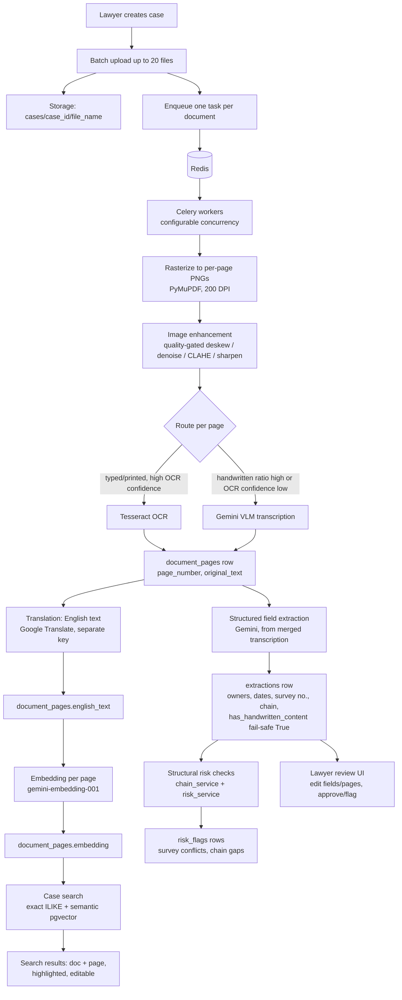
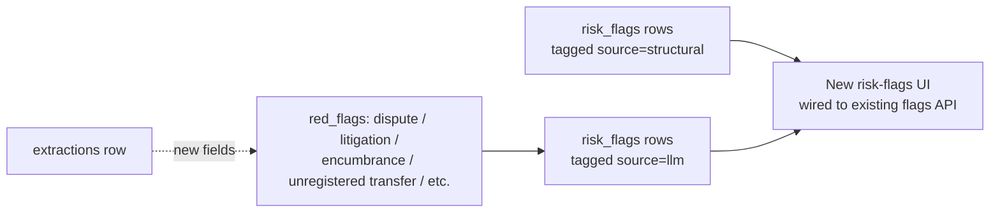

# EasyHuntV2 — Architecture (SOP steps 1–8)

This describes the system **as it exists today**, confirmed by [AUDIT.md](./AUDIT.md), and records the relevant completed changes in [ROADMAP.md](./ROADMAP.md). It is not a greenfield design.

## Components

- **Frontend** — Next.js/React app (`Frontend/src`). Role-gated routes (`Admin`, `Reviewer`) via `ProtectedRoute`. Talks to the backend only through `services/api/client.ts` (`apiClient`) + React Query hooks in `services/api/hooks.ts`.
- **Backend** — FastAPI app (`backend/app`), no ORM — thin repository classes over `supabase-py`'s `.table()`/`.rpc()` client (`app/repositories/*.py`).
- **Supabase** — Postgres (schema defined in the hosted dashboard, not in-repo — see AUDIT.md) + Storage bucket `documents` for original and enhanced page images + pgvector extension for search embeddings.
- **OCR** — Tesseract, local, `eng+hin+mar+tam+tel+kan` (`app/ocr/tesseract_provider.py`).
- **Document queue** — Celery workers with Redis as broker. Docker Compose enables this; ordinary local API development keeps the existing FastAPI background-task path unless `CELERY_ENABLED=true`.
- **VLM/LLM** — Google Gemini (`google.genai`), used for (a) low-confidence/handwritten page transcription, (b) structured field extraction from transcribed text, (c) search-query/page embeddings (`gemini-embedding-001`).
- **Translation** — Google Cloud Translation v2, a separate API key from Gemini's, so translation cost is decoupled from the paid extraction model.

## Data flow — case lifecycle (current, steps 1–8)

### Parallel document processing

The upload endpoint stores every accepted file and document row first, then publishes one `documents.process` Celery task per document. Redis holds the queue; workers load the document from Supabase and run the existing pipeline. The browser reads status from the `documents` table, so no task-result polling or in-process API memory is required. Tasks use late acknowledgement, retry unexpected worker failures twice, and mark a document `flagged` after the final failure. Expected pipeline failures also set `flagged`.

To run the API, Redis, and workers with Docker:

1. Copy `backend/.env.example` to `backend/.env`, then fill in `SUPABASE_URL`, `SUPABASE_KEY`, `SUPABASE_SERVICE_ROLE_KEY`, `SUPABASE_JWT_SECRET`, and any model API keys. Docker Compose loads this file into both the API and worker containers. Do not use the sample values in production.
2. Run `docker compose up --build`.
3. The default worker runs three documents concurrently. Increase capacity with `docker compose up --build --scale worker=2`; this runs two workers at three tasks each. Page work is also concurrent (up to four pages per document), so the highest theoretical VLM parallelism is worker count × worker concurrency × four. Adjust `CELERY_WORKER_CONCURRENCY` if provider limits require a lower ceiling.

On local development without Redis, leave `CELERY_ENABLED=false` and the API retains its prior in-process background processing. Enable it only when a reachable broker and at least one Celery worker are running.

Image enhancement always produces and stores a page artifact when processing succeeds. A clean page can pass through with no pixel-changing enhancement steps; a missing enhanced image therefore indicates that processing is still running or that storing the artifact failed, not that the quality gate skipped saving it. The worker logs identify the document/page for enhancement fallback and storage failures.

## Risk-flag extraction and review

The extraction JSON includes grounded legal red flags, persisted into the existing `risk_flags` table with a `source` tag and surfaced through the existing `flags` API and review UI.

## Roles and ownership (already final)

- `Admin` seeds from env, creates `Reviewer` accounts (`POST /admin/reviewers`) — no self-registration.
- A case has `created_by` and an assignable `reviewer_id`. A `Reviewer` can access a case iff they created it or are assigned to it. `Admin` sees/accesses everything.
- No `Vendor` role exists anywhere in the live code (confirmed in AUDIT.md) — this part of the original brief is already done.
